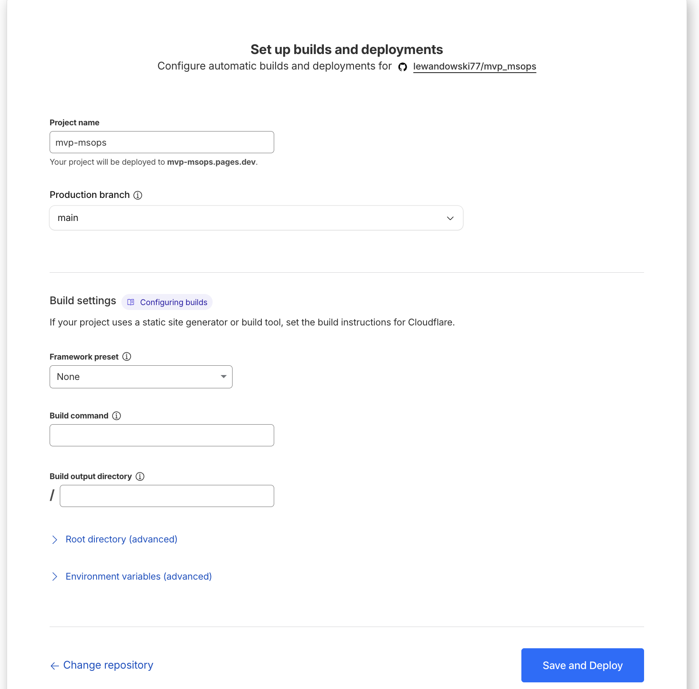

# Wdrozenie strony Astro na Cloudflare Pages

Instrukcja krok po kroku jak wdrozyc projekt Astro na Cloudflare Pages.

## Wymagania

- Konto na [Cloudflare](https://cloudflare.com)
- Repozytorium GitHub z projektem Astro
- Projekt Astro skonfigurowany z `npm run build` i outputem w folderze `dist`

---

## Krok 1: Wejdz do panelu Cloudflare

1. Zaloguj sie na [dash.cloudflare.com](https://dash.cloudflare.com)
2. W menu po lewej wybierz **Workers & Pages**
3. Kliknij **Create application**

---

## Krok 2: Wybierz Pages (nie Workers)

Na ekranie "Ship something new" kliknij link **"Looking to deploy Pages? Get started"** na dole ekranu.

> **Wazne:** Nie wybieraj "Connect GitHub" z tego ekranu - to utworzy Worker, nie Pages.

---

## Krok 3: Polacz repozytorium GitHub

1. Wybierz zakladke **GitHub**
2. Wybierz swoje konto GitHub
3. Znajdz i zaznacz repozytorium z projektem Astro
4. Kliknij **Begin setup**

---

## Krok 4: Skonfiguruj ustawienia buildu

Ustaw nastepujace wartosci:

| Pole | Wartosc |
|------|---------|
| **Project name** | nazwa-projektu |
| **Production branch** | main |
| **Framework preset** | Astro |
| **Build command** | `npm run build` |
| **Build output directory** | `dist` |

Kliknij **Save and Deploy**.

---

## Krok 5: Poczekaj na deployment

Cloudflare automatycznie:
1. Sklonuje repozytorium
2. Zainstaluje zaleznosci
3. Zbuduje projekt
4. Wdrozy na globalna siec CDN

Po zakonczeniu strona bedzie dostepna pod adresem:
`https://nazwa-projektu.pages.dev`

---

## Automatyczne deploymenty

Po skonfigurowaniu, kazdy push do brancha `main` automatycznie:
- Uruchomi nowy build
- Wdrozy nowa wersje strony
- Zajmuje to okolo 30-60 sekund

---

## Rozwiazywanie problemow

### Blad SSL (ERR_SSL_VERSION_OR_CIPHER_MISMATCH)

To normalny blad dla nowych deploymentow. Cloudflare generuje certyfikat SSL - poczekaj 2-5 minut i odswiez strone.

### Build failed

Sprawdz logi buildu w panelu Cloudflare:
1. Wejdz w projekt
2. Kliknij **Deployments**
3. Wybierz ostatni deployment
4. Zobacz **Build log**

Najczestsze przyczyny:
- Brak `package.json`
- Bledna wersja Node.js (ustaw w Environment Variables: `NODE_VERSION` = `18`)
- Bledy w kodzie

---

## Przydatne linki

- [Dokumentacja Cloudflare Pages](https://developers.cloudflare.com/pages/)
- [Dokumentacja Astro](https://docs.astro.build/)
- [Astro + Cloudflare](https://docs.astro.build/en/guides/deploy/cloudflare/)
